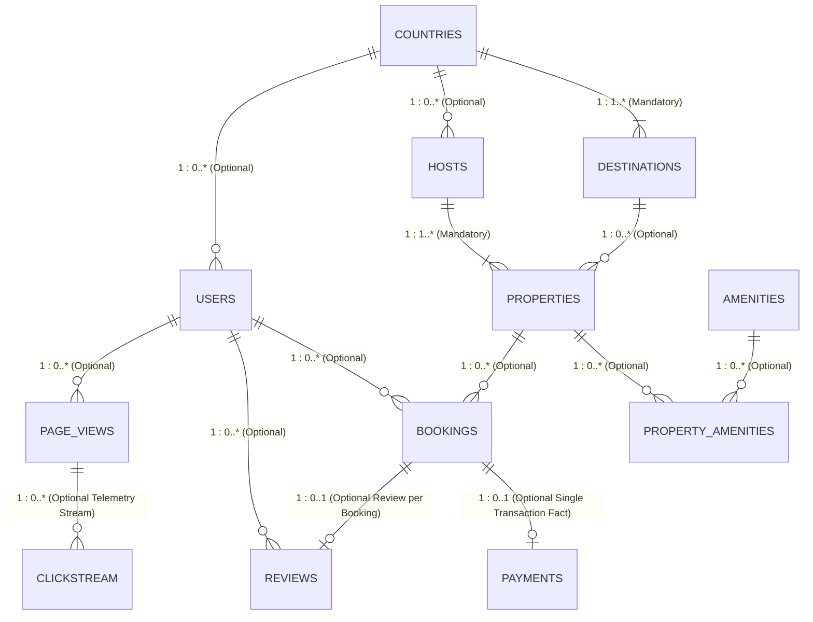

# Data Model Specification: `samples.wanderbricks`

This document serves as the architectural blueprint for the **Wanderbricks** travel & vacation rental marketplace dataset in Databricks (`samples.wanderbricks`). It details the verified 3NF normalized source schema, key constraints, row counts, business domain classifications, and the target Medallion (Bronze $\rightarrow$ Silver $\rightarrow$ Gold) dimensional transformation.

---

## 1. Architectural ER Diagram

The high-resolution architectural diagram is available in:
👉 **[docs/diagrams/01_wanderbricks_3nf_erd.png](docs/diagrams/01_wanderbricks_3nf_erd.png)** (also accessible via [docs/diagrams/wanderbricks_erd_diagram.png](docs/diagrams/wanderbricks_erd_diagram.png))  
👉 Interactive browser viewer: **[docs/erd_diagram.html](docs/erd_diagram.html)**



---

## 2. Relationship Cardinality & Modality (Mandatory vs. Optional)

In Crow's Foot ER notation, **Modality** determines whether a child or parent record is required (**Mandatory**) or discretionary (**Optional**):
* `||` = **1 (Mandatory)**: The referenced record MUST exist.
* `>o` = **0..* or 0..1 (Optional)**: The related record MAY or MAY NOT exist.
* `>|` = **1..* (Mandatory Many)**: At least one related child record MUST exist.

| Parent (1) | Child (M) | Modality | Foreign Key | Business Reason |
| :--- | :--- | :---: | :--- | :--- |
| **`BOOKINGS`** | **`PAYMENTS`** | `1 (Mandatory) → 0..1 (Optional)` | `payments.booking_id` | A payment requires a valid booking, but a booking can be unpaid, pending checkout, or cancelled before payment. |
| **`USERS`** | **`BOOKINGS`** | `1 (Mandatory) → 0..* (Optional)` | `bookings.user_id` | A booking requires a registered user; a user can sign up without placing an immediate booking. |
| **`PROPERTIES`** | **`BOOKINGS`** | `1 (Mandatory) → 0..* (Optional)` | `bookings.property_id` | Every booking is for a real listing; new properties can have 0 bookings initially. |
| **`BOOKINGS`** | **`REVIEWS`** | `1 (Mandatory) → 0..1 (Optional)` | `reviews.booking_id` | A review requires a stay/booking; guests are not obligated to submit a review. |
| **`USERS`** | **`REVIEWS`** | `1 (Mandatory) → 0..* (Optional)` | `reviews.user_id` | Every review is written by a user; users may write 0 or many reviews over time. |
| **`PROPERTIES`** | **`REVIEWS`** | `1 (Mandatory) → 0..* (Optional)` | `reviews.property_id` | Reviews evaluate a property; listings can have 0 or many reviews. |
| **`DESTINATIONS`**| **`PROPERTIES`** | `1 (Mandatory) → 0..* (Optional)` | `properties.destination_id`| Properties belong to a market/city; destinations can exist before inventory is onboarded. |
| **`HOSTS`** | **`PROPERTIES`** | `1 (Mandatory) → 1..* (Mandatory)`| `properties.host_id` | In this catalog, active hosts own at least 1 listing; every property requires a host. |
| **`COUNTRIES`** | **`DESTINATIONS`**| `1 (Mandatory) → 1..* (Mandatory)`| `destinations.country` | Every destination belongs to an ISO country; each recorded country has mapped destinations. |
| **`COUNTRIES`** | **`HOSTS`** | `1 (Mandatory) → 0..* (Optional)` | `hosts.country` | Hosts have an operating country; not all countries necessarily have active hosts. |
| **`COUNTRIES`** | **`USERS`** | `1 (Mandatory) → 0..* (Optional)` | `users.country` | Users reside in a country; countries exist regardless of registered user base. |
| **`PROPERTIES`** | **`PROPERTY_AMENITIES`** | `1 (Mandatory) → 0..* (Optional)` | `property_amenities.property_id` | Properties can have 0 or multiple amenities assigned via the junction bridge. |
| **`AMENITIES`** | **`PROPERTY_AMENITIES`** | `1 (Mandatory) → 0..* (Optional)` | `property_amenities.amenity_id` | Amenity definitions exist in master lookup; may be mapped to 0 or many properties. |
| **`USERS`** | **`PAGE_VIEWS`** | `1 (Mandatory) → 0..* (Optional)` | `page_views.user_id` | Page impressions are logged by users; inactive users generate 0 views. |
| **`PAGE_VIEWS`**| **`CLICKSTREAM`** | `1 (Mandatory) → 0..* (Optional)` | `clickstream.user_id` | In-session UI clicks occur after viewing a page; a view may result in 0 or many clicks. |

---

## 3. Dataset Overview & Verified Row Counts

| Category | Table | Verified Row Count | Role / Type | Primary Business Meaning |
| :--- | :--- | :---: | :--- | :--- |
| **Telemetry & Growth** | `page_views` | **500,000** | Event Fact | In-session page impressions & marketing traffic |
| **Master Data** | `users` | **124,509** | Dimension | Customer / traveler master profiles |
| **Inventory Junction** | `property_amenities` | **118,108** | Junction (M:M) | Maps properties to their amenities |
| **Telemetry & Growth** | `clickstream` | **100,000** | Event Stream | Fine-grained UI click & interaction events |
| **Product & Trust** | `reviews` | **99,793** | Feedback Fact | Post-stay ratings & customer feedback |
| **Commercial / Sales** | `bookings` | **72,247** | Core Fact | Central transactional order engine |
| **Finance & Revenue** | `payments` | **49,638** | Financial Fact | Payment settlements & financial receipts |
| **Partner Management**| `hosts` | **19,384** | Dimension | Property owners and rental hosts |
| **Inventory Catalog** | `properties` | **18,163** | Dimension (Hub) | Core vacation rental property listings |
| **Geographic Master** | `destinations` | **42** | Dimension | City / regional tourism destinations |
| **Inventory Reference**| `amenities` | **38** | Lookup Dim | Feature definitions (Wi-Fi, Pool, AC, etc.) |
| **Geographic Master** | `countries` | Master Ref | Reference Dim | Country codes, ISO standards, continents |

---

## 3. Business Domain Breakdown ("Moving Parts")

In an enterprise organization, data originates across specialized business units:

1. **Finance & Accounting Domain (`payments`)**:
   * Tracks monetary inflows, gateway methods (Credit Card, PayPal, Apple Pay), transaction statuses (`successful`, `failed`, `refunded`), and financial reconciliation against orders.
2. **Sales & Commercial Domain (`bookings`)**:
   * Central reservation pipeline tracking booking confirmations, check-in/out schedules, guest counts, and gross order values.
3. **Customer & User Domain (`users`)**:
   * Traveler master profiles, account tiers (`standard`, `vip`, `business`), corporate travel accounts, and customer lifetime value.
4. **Supply & Inventory Domain (`properties`, `hosts`, `destinations`, `amenities`, `property_amenities`)**:
   * Manages supplier relationships (hosts), listing inventory, regional availability, room counts, nightly base rates, and property amenities.
5. **Marketing & Acquisition Domain (`page_views`, `clickstream`)**:
   * Top-of-funnel acquisition tracking marketing channels (`referrer`), device types (`mobile`, `desktop`), and click conversion drop-offs.
6. **Product & Trust Domain (`reviews`)**:
   * Customer satisfaction scores (1.0 to 5.0), quality monitoring, and host trust metrics.

---

## 4. Detailed Table Schemas & Constraints

> **Note**: For each table, **Key Constraints** (`PK`, `FK`) are clearly isolated from regular **Payload Attributes**, matching the visual diagram.

---

### A. Supply & Inventory Hierarchy

#### 1. `properties` *(18,163 rows — Central Inventory Hub)*
* **Constraints**:
  * `property_id` (`BIGINT`) — **PK**: Unique identifier for the listing.
  * `host_id` (`BIGINT`) — **FK**: References `hosts.host_id`.
  * `destination_id` (`BIGINT`) — **FK**: References `destinations.destination_id`.
* **--- Payload Attributes ---**:
  * `title` (`STRING`) — Marketing title.
  * `base_price` (`DECIMAL(10,2)`) — Nightly base rental rate.
  * `property_type` (`STRING`) — Villa, Apartment, Cabin, House, etc.
  * `max_guests` (`INT`) — Guest capacity limit.
  * `bedrooms` (`INT`) — Bedroom count.
  * `bathrooms` (`DOUBLE`) — Bathroom count.
  * `property_latitude` (`DOUBLE`) — GPS coordinate.
  * `property_longitude` (`DOUBLE`) — GPS coordinate.
  * `created_at` (`TIMESTAMP`) — Listing publish timestamp.

#### 2. `hosts` *(19,384 rows — Property Owners)*
* **Constraints**:
  * `host_id` (`BIGINT`) — **PK**: Unique host identifier.
  * `country` (`STRING`) — **FK**: References `countries.country`.
* **--- Payload Attributes ---**:
  * `name` (`STRING`) — Host full name *(PII)*.
  * `email` (`STRING`) — Host email address *(PII)*.
  * `phone` (`STRING`) — Contact phone number *(PII)*.
  * `is_verified` (`BOOLEAN`) — Identity verification flag.
  * `is_active` (`BOOLEAN`) — Active hosting status.
  * `rating` (`DOUBLE`) — Average host reputation score.
  * `joined_at` (`TIMESTAMP`) — Onboarding date.

#### 3. `destinations` *(42 rows — Cities & Regions)*
* **Constraints**:
  * `destination_id` (`BIGINT`) — **PK**: Unique destination identifier.
  * `country` (`STRING`) — **FK**: References `countries.country`.
* **--- Payload Attributes ---**:
  * `destination` (`STRING`) — City / market name.
  * `state_or_province` (`STRING`) — State, province, or region.
  * `description` (`STRING`) — Travel overview.

#### 4. `countries` *(Master Reference)*
* **Constraints**:
  * `country` (`STRING`) — **PK**: Full country name.
* **--- Payload Attributes ---**:
  * `country_code` (`STRING`) — ISO 2-character / 3-character code.
  * `continent` (`STRING`) — Continental classification.

#### 5. `amenities` *(38 rows — Feature Catalog)*
* **Constraints**:
  * `amenity_id` (`BIGINT`) — **PK**: Unique amenity key.
* **--- Payload Attributes ---**:
  * `name` (`STRING`) — Feature name (e.g., "High-speed Wi-Fi", "Pool").
  * `category` (`STRING`) — Category (e.g., "Luxury", "Essentials").
  * `icon` (`STRING`) — UI icon identifier.

#### 6. `property_amenities` *(118,108 rows — M:M Bridge Table)*
* **Constraints**:
  * `property_id` (`BIGINT`) — **PK, FK**: References `properties.property_id`.
  * `amenity_id` (`BIGINT`) — **PK, FK**: References `amenities.amenity_id`.
* **--- Payload Attributes ---**: None (Pure associative bridge table).

---

### B. Commercial Transactions & Customer Demand

#### 7. `bookings` *(72,247 rows — Core Order Fact)*
* **Constraints**:
  * `booking_id` (`BIGINT`) — **PK**: Unique order reservation ID.
  * `user_id` (`BIGINT`) — **FK**: References `users.user_id`.
  * `property_id` (`BIGINT`) — **FK**: References `properties.property_id`.
* **--- Payload Attributes ---**:
  * `check_in` (`DATE`) — Reservation arrival date.
  * `check_out` (`DATE`) — Reservation departure date.
  * `guests_count` (`INT`) — Number of staying guests.
  * `total_amount` (`DECIMAL(10,2)`) — Gross order value ($).
  * `status` (`STRING`) — Status (`confirmed`, `completed`, `cancelled`).
  * `created_at` (`TIMESTAMP`) — Order placement timestamp.
  * `updated_at` (`TIMESTAMP`) — Last modification timestamp.

#### 8. `payments` *(49,638 rows — Single Financial Settlement Fact)*
* **Constraints**:
  * `payment_id` (`BIGINT`) — **PK**: Unique payment transaction ID.
  * `booking_id` (`BIGINT`) — **FK**: References `bookings.booking_id`.
* **--- Payload Attributes ---**:
  * `amount` (`DECIMAL(10,2)`) — Settlement value paid ($).
  * `payment_method` (`STRING`) — Payment gateway (`credit_card`, `paypal`, etc.).
  * `status` (`STRING`) — Status (`successful`, `failed`, `refunded`).
  * `payment_date` (`TIMESTAMP`) — Processing timestamp.

#### 9. `users` *(124,509 rows — Travelers / Customers)*
* **Constraints**:
  * `user_id` (`BIGINT`) — **PK**: Unique traveler customer ID.
  * `country` (`STRING`) — **FK**: References `countries.country`.
* **--- Payload Attributes ---**:
  * `name` (`STRING`) — Customer name *(PII)*.
  * `email` (`STRING`) — Customer email *(PII)*.
  * `user_type` (`STRING`) — Membership level (`standard`, `vip`, `business`).
  * `is_business` (`BOOLEAN`) — Corporate business traveler flag.
  * `company_name` (`STRING`) — Employer name if corporate account.
  * `created_at` (`TIMESTAMP`) — Account registration date.

---

### C. Feedback & High-Volume Telemetry

#### 10. `reviews` *(99,793 rows — Post-Stay Feedback)*
* **Constraints**:
  * `review_id` (`BIGINT`) — **PK**: Unique review identifier.
  * `booking_id` (`BIGINT`) — **FK**: References `bookings.booking_id`.
  * `user_id` (`BIGINT`) — **FK**: References `users.user_id`.
  * `property_id` (`BIGINT`) — **FK**: References `properties.property_id`.
* **--- Payload Attributes ---**:
  * `rating` (`DOUBLE`) — Star rating (1.0 to 5.0).
  * `comment` (`STRING`) — Review feedback text.
  * `is_deleted` (`BOOLEAN`) — Soft deletion indicator.
  * `created_at` (`TIMESTAMP`) — Review creation timestamp.

#### 11. `page_views` *(500,000 rows — Browsing Events)*
* **Constraints**:
  * `view_id` (`BIGINT`) — **PK**: Unique impression ID.
  * `user_id` (`BIGINT`) — **FK**: References `users.user_id`.
  * `property_id` (`BIGINT`) — **FK**: References `properties.property_id`.
* **--- Payload Attributes ---**:
  * `device_type` (`STRING`) — `mobile`, `desktop`, `tablet`.
  * `page_url` (`STRING`) — Web page path.
  * `referrer` (`STRING`) — Acquisition source (`google`, `direct`, `social`).
  * `timestamp` (`TIMESTAMP`) — Impression timestamp.

#### 12. `clickstream` *(100,000 rows — Telemetry Interaction Stream)*
* **Constraints**:
  * `user_id` (`BIGINT`) — **FK**: References `users.user_id`.
  * `property_id` (`BIGINT`) — **FK**: References `properties.property_id`.
* **--- Payload Attributes ---**:
  * `event` (`STRING`) — Action name (`search`, `filter_by_price`, `favorite`).
  * `metadata` (`STRING JSON`) — Contextual payload parameters.
  * `timestamp` (`TIMESTAMP`) — Interaction timestamp.

---

## 5. Medallion ETL Architecture Plan

```text
       Raw Source (3NF)                Cleaned & Conformed (3NF)                Analytics Marts (Star Schema)
┌─────────────────────────────┐       ┌─────────────────────────────┐       ┌─────────────────────────────────┐
│     samples.wanderbricks    │  ==>  │         dev.silver          │  ==>  │            dev.gold             │
│  - 12 Relational Tables     │       │  - PII Masking (sha2)       │       │  - fact_bookings (Orders+Pay)   │
│  - Normalized Constraints   │       │  - Data Quality Rules (DQ)  │       │  - dim_property (Wide Dim)      │
│  - Raw 3NF Transactions     │       │  - Deduplication & Parsing  │       │  - dim_user (Customer 360)      │
│                             │       │                             │       │  - fact_web_funnel (Conversion) │
└─────────────────────────────┘       └─────────────────────────────┘       └─────────────────────────────────┘
```

### Gold Layer Dimensional Targets (Star Schema):
1. **`gold.fact_bookings`**:
   * **Grain**: One row per reservation.
   * **Dimensions**: `date_key`, `user_key`, `property_key`, `destination_key`.
   * **Metrics**: `total_amount`, `nightly_rate`, `length_of_stay_nights`, `payment_amount`, `payment_status`.
2. **`gold.dim_property`**:
   * Denormalized dimension merging `properties`, `destinations`, `countries`, `hosts`, and an aggregated count of available amenities.
3. **`gold.dim_user`**:
   * Conformed customer dimension with masked PII (`sha2(email, 256)`), geography, and loyalty tier.
4. **`gold.fact_conversion_funnel`**:
   * Aggregates `page_views` and `clickstream` to measure visitor drop-off from search $\rightarrow$ property view $\rightarrow$ booking.
