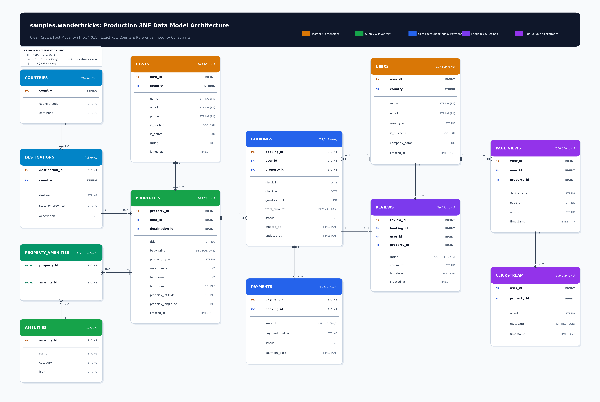

# Wanderbricks Databricks ETL Project

An end-to-end enterprise data engineering project building a **Medallion Architecture (Bronze $\rightarrow$ Silver $\rightarrow$ Gold)** on **Databricks** and **Delta Lake**, leveraging the normalized 3NF source catalog `samples.wanderbricks`.

---

## 🏛️ Architecture & Data Model

The verified source dataset consists of **11 core operational tables + 1 master reference table** totaling over 1,000,000 records.



### Key Architectural Documents
- **[DATA_MODEL.md](DATA_MODEL.md)**: Full normalized 3NF schema, verified table row counts, Crow's Foot modality matrix, and target Gold dimensional model.
- **[High-Res ERD Diagram (PNG)](docs/diagrams/wanderbricks_erd_diagram.png)**: High-resolution 300 DPI diagram with Crow's Foot cardinality notation.
- **[Interactive HTML ERD Viewer](docs/erd_diagram.html)**: Standalone web viewer with responsive Mermaid.js diagram.

---

## 📂 Project Structure

```
Databricks projects/
├── .env                              # Local credentials (git-ignored)
├── .env.example                      # Template for workspace URL & PAT
├── .gitignore                        # Git exclusion rules
├── README.md                         # Project overview, setup, and run instructions
├── DATA_MODEL.md                     # Source schema & Medallion dimensional design
├── requirements.txt                  # Python dependencies
│
├── docs/                             # Architectural documentation & visual artifacts
│   ├── erd_diagram.html              # Interactive browser ERD viewer
│   └── diagrams/                     # High-resolution architectural diagrams
│       ├── wanderbricks_erd_diagram.png
│       └── wanderbricks_erd_diagram.jpg
│
├── scripts/                          # Tooling & setup utilities (sequentially ordered)
│   ├── 01_test_connection.py         # Databricks workspace authentication tester
│   ├── 02_inspect_wanderbricks.py    # Schema inspector for samples.wanderbricks
│   ├── 03_generate_erd.py            # Modular, reusable ERD rendering engine
│   ├── 04_seed_local_mysql.py        # Local MySQL OLTP database setup & seeder
│   └── 05_start_tunnel.py            # Secure TCP tunnel launcher for Databricks JDBC
│
├── src/                              # Core ETL Pipeline (Medallion Architecture)
│   ├── common/                       # Shared Spark session helpers, logging, & configs
│   ├── bronze/                       # Raw ingestion from samples.wanderbricks to Delta
│   ├── silver/                       # Cleansing, PII hashing (sha2), DQ rules, & deduplication
│   └── gold/                         # Gold Star Schema modeling (fact_bookings, dim_*, etc.)
│
├── notebooks/                        # Interactive Databricks runner notebooks (sequentially ordered)
│   ├── 00_setup.py
│   ├── 01_bronze_ingestion.py
│   ├── 02_silver_transformations.py
│   └── 03_gold_star_schema.py
│
├── config/                           # Pipeline configuration files
└── tests/                            # Unit & data transformation test suite
```

---

## 🚀 Quick Start

### 1. Environment Setup
Create and activate a virtual environment, then install dependencies:
```bash
python -m venv .venv
.\.venv\Scripts\activate      # On Windows
pip install -r requirements.txt
```

### 2. Configure Credentials
Copy `.env.example` to `.env` and fill in your Databricks workspace URL and Personal Access Token (PAT):
```bash
cp .env.example .env
```

### 3. Verify Databricks Connectivity
```bash
python scripts/01_test_connection.py
```

### 4. Inspect Source Catalog
```bash
python scripts/02_inspect_wanderbricks.py
```

### 5. Regenerate Architecture Diagrams
```bash
python scripts/03_generate_erd.py
```
Outputs are automatically written to `docs/diagrams/01_wanderbricks_3nf_erd.png` (and `wanderbricks_erd_diagram.png`).

### 6. Sync Local MySQL OLTP Database from Databricks
```bash
python scripts/04_seed_local_mysql.py
```
Streams and populates all 12 normalized 3NF tables in your local MySQL database (`wanderbricks`) with the full **1,102,090 records** directly from Databricks Unity Catalog (`samples.wanderbricks.*`).

### 7. Launch Secure TCP Tunnel (No Credit Card / No Signup)
```bash
python scripts/05_start_tunnel.py
```
Establishes an encrypted public TCP tunnel (`bore.pub:PORT -> localhost:3306`) so Cloud Databricks can connect directly to your laptop's MySQL via JDBC.

---

## 🔄 Medallion Pipeline Roadmap

1. **Bronze Layer (`src/bronze/`)**:
   - Ingest raw tables from `samples.wanderbricks.*` into managed Delta Lake tables.
   - Append audit metadata (`_ingested_at`, `_source_table`).
2. **Silver Layer (`src/silver/`)**:
   - Anonymize PII (`name`, `email`, `phone` via SHA-256 / salt).
   - Apply Data Quality expectations (non-null keys, positive booking amounts, valid dates).
   - Deduplicate event logs.
3. **Gold Layer (`src/gold/`)**:
   - Model the analytical Star Schema:
     - `fact_bookings`: Central reservation orders joined with payment status.
     - `fact_funnel`: Session impressions $\rightarrow$ clicks $\rightarrow$ bookings conversion funnel.
     - `dim_property`, `dim_user`, `dim_host`, `dim_date`: Conformed analytical dimensions.
